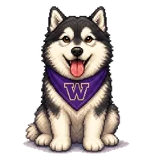

# UW Dubs Codex Pet


An unofficial UW-inspired custom pet for Codex Desktop.

Dubs Buddy is a native Codex custom pet, not a standalone desktop app. It installs through `Appearance -> Pets -> Custom pets` and uses Codex's fixed spritesheet format: `8 x 9` frames, `192 x 208` pixels per frame, `1536 x 1872` pixels total.



## Quick Start

1. Download `uw-dubs-codex-pet-v3.1.0.zip` from the [latest release](https://github.com/FlalaGoGoGo/uw-dubs-codex-pet/releases/latest).
2. Unzip it. You should see a folder named `dubs-buddy`.
3. Copy `dubs-buddy` into your Codex custom pets directory.
4. In Codex Desktop, open `Appearance -> Pets -> Custom pets -> Refresh -> Dubs Buddy -> Wake Pet`.

macOS:

```bash
mkdir -p ~/.codex/pets
cp -R dubs-buddy ~/.codex/pets/dubs-buddy
```

Windows PowerShell:

```powershell
$petDir = "$env:USERPROFILE\.codex\pets"
New-Item -ItemType Directory -Force $petDir | Out-Null
Copy-Item -Recurse -Force ".\dubs-buddy" "$petDir\dubs-buddy"
```

## Features

- Native Codex custom pet package with no Electron, Tauri, or background app.
- Nine Codex state rows, each with eight effective frames.
- Idle, side-running, waving, jumping, waiting, working, failed, and review animations.
- Transparent spritesheet build pipeline with frame alignment and motion QA.
- Release zip for direct install, plus source build scripts for contributors.

## Build From Source

```bash
git clone https://github.com/FlalaGoGoGo/uw-dubs-codex-pet.git
cd uw-dubs-codex-pet
npm install
npm run build
npm run verify
npm run install:pet
```

After installing, refresh the custom pet list in Codex and select `Dubs Buddy`.

## Commands

```bash
npm run build           # generate dist/dubs-buddy and QA previews
npm run verify          # validate manifest, spritesheet, frame drift, previews, and transparency
npm run status:pet      # compare dist/dubs-buddy with the installed Codex pet
npm run install:pet     # copy dist/dubs-buddy to ~/.codex/pets/dubs-buddy
npm run package:zip     # create release/uw-dubs-codex-pet-v3.1.0.zip
npm run prepare:release # build, verify, and package
```

## Repository Layout

```text
dist/dubs-buddy/          generated Codex pet package after npm run build
docs/                     install, development, publishing, and Word guide materials
docs/media/               README demo media
references/style/         style anchor image
references/source-sheets/ current 4 x 2 animation reference sheets
scripts/                  build, verify, install, status, and packaging scripts
release/                  generated release zips after npm run package:zip
```

Generated folders such as `generated/`, `dist/`, `release/`, and `docs/rendered/` are ignored by git.

## Codex State Mapping

| Row | Codex state | Dubs Buddy animation |
| --- | --- | --- |
| 0 | `idle` | Sitting, breathing, blinking |
| 1 | `running-right` | Right-facing side run |
| 2 | `running-left` | Left-facing side run |
| 3 | `waving` | Friendly paw wave |
| 4 | `jumping` | Real jump / hover attention |
| 5 | `failed` | Sad and crying |
| 6 | `waiting` | Watching an hourglass |
| 7 | `running` | Typing on a laptop |
| 8 | `review` | Happy gift-box success |

More detail: [docs/STATE_MAPPING.md](docs/STATE_MAPPING.md)

## Version History

<details open>
<summary><strong>v3.1.0</strong> - current public release</summary>

- Adds the current personality motion pack: idle, waving, sad failed, hourglass waiting, laptop working, and gift-box review.
- Keeps side-running left and right, plus jumping, as native Codex state rows.
- Cleans the public repo structure so reference artwork lives under `references/` instead of version-specific folders.
- Packages the pet as `uw-dubs-codex-pet-v3.1.0.zip`.
- Includes install docs, a Word setup guide, QA previews, and publish notes.

</details>

<details>
<summary><strong>v3.0.0</strong> - release polish milestone</summary>

- Standardized the native Codex spritesheet build and verification flow.
- Added stronger QA outputs, including preview galleries, transition previews, and demo WebP generation.
- Removed the older rollback-oriented packaging flow so the repo could focus on the current public release.

</details>

<details>
<summary><strong>v2.x</strong> - prototype motion exploration</summary>

- Explored native Codex pet motion constraints, side-running, jumping, and core-state smoothing.
- Earlier prototype assets are not kept in the public repo to avoid confusing new users.

</details>

## Troubleshooting

- If Dubs Buddy does not appear, confirm the folder is exactly `~/.codex/pets/dubs-buddy` on macOS or `%USERPROFILE%\.codex\pets\dubs-buddy` on Windows.
- If Codex was already open, click `Refresh` in `Appearance -> Pets -> Custom pets`, or restart Codex.
- If the pet appears with a white box or bad cropping, run `npm run build && npm run verify` and check `dist/preview-contact-sheet.png`.
- If the installed version looks old, run `npm run status:pet`, then reinstall with `npm run install:pet`.

## Documentation

- [Install guide](docs/INSTALL.md)
- [State mapping](docs/STATE_MAPPING.md)
- [Development notes](docs/DEVELOPMENT.md)
- [Publishing notes](docs/PUBLISHING.md)
- [Reference assets](references/README.md)
- [Word setup guide](docs/Dubs_Buddy_Setup_Guide.docx)

## Contributing

Small improvements are welcome. Please read [CONTRIBUTING.md](CONTRIBUTING.md) before opening a pull request, especially if you are adding new reference artwork.

## Unofficial Fan Project

Dubs Buddy is a non-commercial, unofficial fan project. It is not affiliated with, endorsed by, or sponsored by the University of Washington or OpenAI.

UW names, colors, logos, mascot references, and the Block W may involve University trademark rules. Review the official UW resources before broad distribution or any commercial use:

- [UW Trademarks & Licensing](https://www.washington.edu/trademarks/)
- [UW Brand Trademarks & Licensing](https://www.washington.edu/brand/marketing-resources/trademarks-licensing/)
